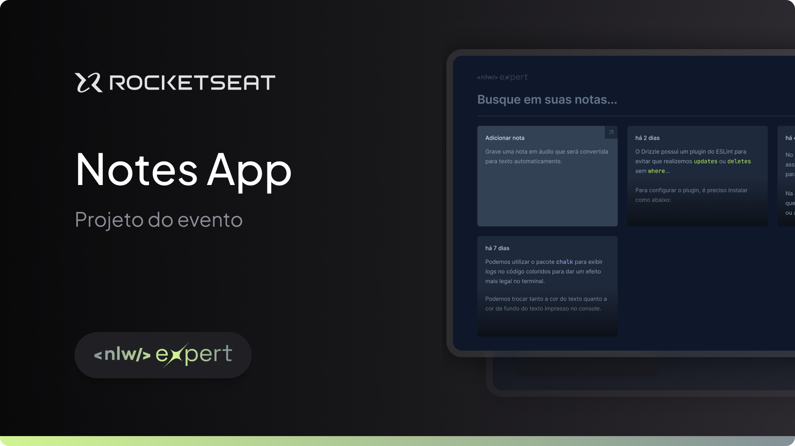

# NLW Notes

Project developed on Rocketseat's NLW Expert

**NLW Notes is a website that allows you to save text notes generated from speech recognition with the browser API, designed to learn basic ReactJS concepts**

## 🔗 Project Links

- 🚀 [**Deploy**](https://notes-nlw-app.vercel.app/)

## 📋 Project information

- NWL Expert React

## 🧠 Concepts learned

The development of this project aims to learn the following concepts:

- SpeechRecognition browser API
- Style with TailwindCSS
- RadixUI for dialog popup
- Sonner library for toast component

## 💻 Technologies

## 📄 License

This project is licensed under the MIT License - see the [LICENSE](./LICENSE) file for more details.
